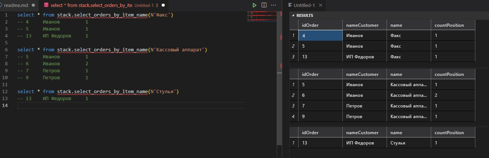
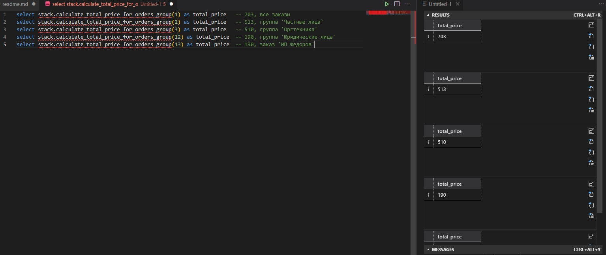
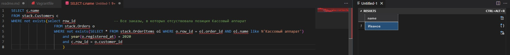

Для выполнения задания использовал SQL Server 2014 Express, запускамый в виде Docker-конейнера.

### Задача 1
Написать функцию select_orders_by_item_name. Она получает один аргумент - наименование позиции (строка),
и должна найти все заказы, в которых имеется позиция с данным наименованием. Кроме того, она должна
подсчитать количество позиций с указанным наименованием в каждом отдельном заказе. 

#### Решение:
```sql
CREATE FUNCTION stack.select_orders_by_item_name
(@namePosition nvarchar(max))
RETURNS TABLE AS
RETURN
(	
	SELECT	o.row_id as idOrder
			, c.name as nameCustomer 
			, oi.name
			, count(oi.row_id) as countPosition 
	FROM stack.Orders O
		INNER JOIN stack.OrderItems OI	ON O.row_id = OI.order_id
		INNER JOIN stack.Customers C	ON c.row_id = O.customer_id
	WHERE Upper(oi.name) LIKE UPPER (@namePosition)  
	GROUP BY o.row_id, c.name, oi.name
)
```
#### Результат выполнения:


### Задача 2.
Написать функцию calculate_total_price_for_orders_group. Она получает row_id группы (либо заказа),
и возвращает суммарную стоимость всех позиций всех заказов в этой группе (заказе), причем 
суммирование должно выполняться по всему поддереву заказов, начинающемуся с данной группы.
Функция должна возвращать число.

#### Решение
При выполнении этого задания я использовал конструкцию WITH, позволяющую выполнить рекурсивный запрос.
При проектировании реальной БД я бы для такой таблицы использовал тип данных HYERARCHY либо строковый столбец в котором бы формировал строку с иерархичным кодом, что позволило бы использовать более простые конструкцию (на мой взгляд)  
```sql
CREATE FUNCTION stack.calculate_total_price_for_orders_group(@igGroup INT)
RETURNS INT
AS 
BEGIN
	DECLARE @result INT;
	WITH OrderTree (ID, ParentID, Name) -- Использовал конструкцию WITH, позволяющую выполнить рекурсивныз запрос
	AS
	(
	 SELECT row_id, parent_id, group_name
	 FROM stack.Orders O
	 WHERE o.row_id = @igGroup
	 UNION ALL
	 SELECT row_id, parent_id, group_name
	 FROM stack.Orders O
	 JOIN OrderTree rec ON o.parent_id = rec.ID
	)

	SELECT @result = sum(price)
	FROM OrderTree OD 
		LEFT JOIN stack.OrderItems OI	ON OD.ID = OI.order_id
	RETURN @result
END 
```
#### Результат выполнения


### Задача 3
Написать запрос, возвращающий наименования всех покупателей, у которых каждый заказ в 2020 году содержит
как минимум одну позициию с наименованием "Кассовый аппарат".

#### Решение:
Для выполнения использовал подзапросы (считаю не самой хорошей идеей, так как не самым лучшим способом влияет на скорость выполнения, и страдает читабельность и понимание кода)
```sql
SELECT c.name
FROM stack.Customers c
WHERE not exists(select row_id					-- Все заказы, в которых отсуствовала позиция Кассовый аппарат
					FROM stack.Orders o
					WHERE not exists(SELECT * FROM stack.OrderItems oi WHERE o.row_id = oi.order_id AND oi.name like N'Кассовый аппарат')
						and year(o.registered_at) = 2020
						and c.row_id = o.customer_id
						) 
```
#### Результат
